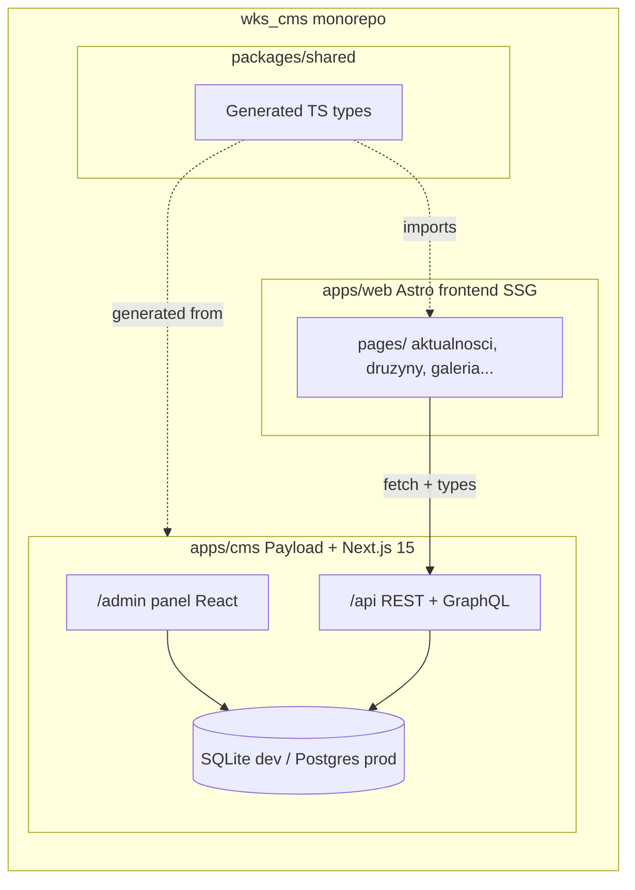
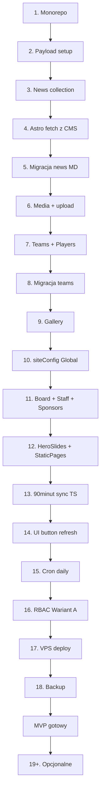

# Roadmap implementacji Payload CMS dla WKS Wierzbice

> Operacyjny dokument wykonawczy — lista etapów implementacji panelu admina
> w Payload CMS 3 + monorepo (`apps/web` + `apps/cms` + `packages/shared`).
>
> **Powstał:** 2026-04-25 po decyzjach D1 (Payload) i D2 (monorepo).
> **Konwencja:** każdy etap = 2–6 h pracy = jedna konkretna rzecz działa
> lokalnie, z test-case'em na końcu.
>
> **Powiązane:** [`ADMIN-PANEL.md`](ADMIN-PANEL.md) (encje, RBAC, integracja
> 90minut), [`STACK-COMPARISON.md`](STACK-COMPARISON.md) (uzasadnienie wyboru
> Payload), [`OFERTA.md`](OFERTA.md) (scope, ekonomia).

---

## Cel i konwencja

**Cel:** dostarczyć działający panel admina pozwalający zarządzać wszystkimi
encjami strony (12 grup z [`ADMIN-PANEL.md`](ADMIN-PANEL.md)), z 3 rolami
RBAC i integracją z 90minut.pl, deployowany na VPS z backupem.

**Konwencja drobnych etapów (decyzja Tomka 2026-04-25):**
- 1 etap = 2–6 h pracy.
- Każdy etap kończy się **konkretnym test-case'em** — coś musi działać
  lokalnie i być sprawdzalne ręcznie.
- Po każdym etapie aktualizujemy [`STATE.md`](STATE.md) (status etapu) i
  dopisujemy do [`CHANGELOG.md`](CHANGELOG.md).
- Przed startem każdego etapu Claude zadaje 1–2 pytania doprecyzowujące
  jeżeli pojawiły się otwarte decyzje (zgodnie z zasadą Tomka „przed każdą
  czynnością zapytaj").

**Łączna estymata:** 60–80 h (tak jak w [`STACK-COMPARISON.md`](STACK-COMPARISON.md)).

---

## Architektura docelowa

**Kluczowe założenia architektury:**
- `apps/web` zachowuje SSG (zero JS po stronie klienta poza wyjątkami z
  `CLAUDE.md`) — przy buildzie pobiera dane z Payload REST API.
- `apps/cms` to standalone Next.js 15 z Payload — własny `package.json`,
  własny deploy.
- `packages/shared` zawiera typy generowane przez `payload generate:types`
  importowane przez `apps/web` dla type-safety przy fetch.

---

## Decyzje techniczne

### RESOLVED w trakcie planowania

| ID | Decyzja | Wynik | Data |
|---|---|---|---|
| D1 | Stack panelu admina | Payload CMS 3 | 2026-04-25 |
| D2 | Struktura repo | Monorepo (`apps/web` + `apps/cms` + `packages/shared`) | 2026-04-25 |
| D9 | Scope encji | Pełen (wszystkie encje z OFERTA.md Q5) | 2026-04-25 |

### Do podjęcia w konkretnych etapach

| ID | Decyzja | Etap, w którym zapadnie | Wstępny default |
|---|---|---|---|
| D4 | Baza danych | Etap 2 (dev) + Etap 17 (prod) | SQLite dev → Postgres 16 prod |
| D5 | Auth | Etap 2 | Payload built-in: email + password |
| D7 | Model RBAC | Etap 16 | Wariant A (3 sztywne role: admin/redaktor/trener) |
| D8 | Model galerii | Etap 9 | Wariant 1 (płaska lista, gotowość na albumy) |
| D3 | Hosting | Etap 17 | VPS (Hetzner CX22 albo OVH SSD) |
| D6 | Backup | Etap 18 | `pg_dump` cron → Backblaze B2, retention 30 dni |
| D10 | Migracja MD→DB | Per encja (Etapy 5, 8, 10, 11) | Skrypty seed używające Payload Local API |

---

## Etapy

### Faza A — fundament (Etapy 1–3, ~10–16 h)

#### Etap 1. Restrukturyzacja monorepo

**Status:** [ ] not started

**Co robimy:**
- Tworzymy strukturę `apps/web/` i przenosimy do niej obecne: `src/`, `public/`, `scripts/`, `astro.config.mjs`, `tailwind.config.mjs`, `tsconfig.json`, `package.json` (renamed do `apps/web/package.json`).
- Tworzymy korzeń monorepo z nowym `package.json` z `workspaces: ["apps/*", "packages/*"]`.
- Pusty `apps/cms/` (placeholder, wypełnimy w Etapie 2).
- Pusty `packages/shared/` z minimalnym `package.json`.
- Aktualizacja [`CLAUDE.md`](../CLAUDE.md) ścieżek (`src/` → `apps/web/src/`).

**Test:**
- `npm install` w korzeniu monorepo działa.
- `npm run dev --workspace=web` → strona działa jak była na localhost:4321.
- `npm run build --workspace=web` → `apps/web/dist/` powstaje, ten sam build co wcześniej.
- Test wizualny: wszystkie 4 szablony (klasyk/marka/magazyn/stadion) renderują się poprawnie.

**Decyzje przed startem:**
- Workspace manager: npm / pnpm / yarn?
- Wersja Node.js do ustabilizowania (Payload 3 wymaga Node 20+).

#### Etap 2. Setup Payload CMS w `apps/cms/`

**Status:** [ ] not started

**Co robimy:**
- `cd apps/cms && npx create-payload-app@latest .` z template Next.js + adapter SQLite (`@payloadcms/db-sqlite`).
- Konfiguracja `apps/cms/payload.config.ts`: nazwa kolekcji `users` z auth (email + password), URL `http://localhost:3000`.
- Plik `.env.local` z `PAYLOAD_SECRET` (random 32 bytes), `DATABASE_URI=file:./payload.db`.
- Skrypt `npm run dev --workspace=cms` w root `package.json`.

**Test:**
- `npm run dev --workspace=cms` → Next.js startuje na localhost:3000.
- Wejście na `localhost:3000/admin` → first-user signup (email + hasło).
- Po signup → automatyczne logowanie → widok dashboardu Payload.
- Wylogowanie + logowanie z powrotem → działa.

**Decyzje przed startem:**
- D5 default OK? (email + password, bez OAuth na start).

#### Etap 3. Pierwsza encja `News` w Payload

**Status:** [ ] not started

**Co robimy:**
- `apps/cms/src/collections/News.ts` — collection config skopiowany 1:1 z Zod schema w `apps/web/src/content/config.ts`.
- Pola: `title` (text, required), `date` (date, required), `excerpt` (textarea), `cover` (text na razie, w Etapie 6 zmienimy na upload), `coverAlt` (text), `tags` (select hasMany z opcjami z istniejącego schema), `body` (richText Lexical), `draft` (checkbox), `facebookUrl` (text), `truncated` (checkbox).
- `slug` autogenerowany z `title` (hook `beforeChange`).
- Rejestracja w `payload.config.ts`.

**Test:**
- W panelu pojawia się sekcja „News" w sidebarze.
- Mogę dodać nowy artykuł, wypełnić wszystkie pola, zapisać → widzę go na liście.
- Edycja istniejącego → zapis działa.
- Usunięcie → znika z listy.
- `payload.db` zawiera tabelę `news` z dodanymi rekordami (sprawdzam SQLite browser-em).

---

### Faza B — frontend czyta z CMS (Etapy 4–5, ~6–10 h)

#### Etap 4. Astro odpytuje Payload REST

**Status:** [ ] not started

**Co robimy:**
- Modyfikacja `apps/web/src/pages/aktualnosci/index.astro` i `apps/web/src/pages/aktualnosci/[slug].astro` — zamiast `getCollection('news')` → `fetch('${PAYLOAD_URL}/api/news?where[draft][equals]=false&sort=-date')`.
- Env var `PAYLOAD_URL` w `apps/web/.env` (default: `http://localhost:3000`).
- Helper `apps/web/src/lib/cms.ts` z typowanym fetch wrapperem (na razie bez generowanych typów, dodamy je później).
- Adapter danych — Payload zwraca `docs[]` z różnymi nazwami pól; mapuje do tego, czego oczekuje istniejący komponent `NewsCard`.

**Test:**
- Newsa dodanego w Etapie 3 widać na localhost:4321/aktualnosci.
- Klik w newsa → `/aktualnosci/<slug>` renderuje pełną treść.
- `npm run build --workspace=web` przechodzi (z działającym CMS-em w tle).
- Z wyłączonym CMS-em build albo gracefully fallbackuje, albo daje czytelny błąd (do ustalenia).

#### Etap 5. Migracja 24 newsów MD → Payload

**Status:** [ ] not started

**Co robimy:**
- `apps/cms/scripts/migrate-news.ts` — czyta wszystkie `apps/web/src/content/news/*.md` przez `gray-matter`, parsuje frontmatter, używa Payload Local API (`getPayload({ config }).create({ collection: 'news', data })`).
- Mapowanie pól: `date` (string → Date), `tags`, `cover` (string ścieżki → na razie zostaje string, w Etapie 6 podmienimy na upload).
- Idempotentność: skrypt sprawdza czy news o danym `slug` już istnieje, pomija duplikaty.

**Test:**
- `npm run migrate:news --workspace=cms` → 24 newsy w bazie.
- /aktualnosci pokazuje wszystkie 24, posortowane po dacie malejąco.
- Wyrywkowo sprawdzam 3 newsy: tytuł, data, tagi, cover, treść poprawne.
- Re-run skryptu nie tworzy duplikatów.

---

### Faza C — media + drużyny (Etapy 6–8, ~10–16 h)

#### Etap 6. Collection `Media` + upload obrazków

**Status:** [ ] not started

**Co robimy:**
- `apps/cms/src/collections/Media.ts` — built-in Payload upload collection.
- Konfiguracja sharp: resize do max 1600 px, konwersja do WebP, thumbnaile (320, 640, 1024).
- Storage: `apps/cms/uploads/` (lokalnie), w produkcji to samo na VPS (Etap 17).
- Pole `cover` w `News` zmienione z `text` na `upload` z `relationTo: 'media'`.
- Skrypt `migrate-news-covers.ts` — pobiera istniejące pliki z `apps/web/public/news/*` i tworzy rekordy Media + linkuje do odpowiednich newsów.

**Test:**
- W panelu: dodaję nowy news, klikam „upload cover", wybieram plik z dysku → zdjęcie się ładuje, preview widać w panelu.
- /aktualnosci wyświetla cover (już z Payload, nie z `public/news/`).
- Sprawdzam wymiary uploadowanego zdjęcia w `apps/cms/uploads/` — są resized do 1600 px max + WebP.
- Wszystkie 24 zmigrowane newsy mają poprawne covery.

#### Etap 7. Collections `Teams` + `Players`

**Status:** [ ] not started

**Co robimy:**
- `apps/cms/src/collections/Teams.ts` — pola z `teams` schema w `apps/web/src/content/config.ts`: `name`, `category` (select enum), `league`, `coach`, `assistantCoach`, `trainingSchedule`, `photo` (upload), `order`, `description` (richText).
- `apps/cms/src/collections/Players.ts` — `name`, `number`, `position`, `team` (relationship `relationTo: 'teams'`), `photo` (opcjonalne, upload).
- Decyzja modelowa: roster jako osobna kolekcja `Players` z relacją do `Teams` (zamiast embedded array) — pozwala na granular edit i przyszłość (statystyki per zawodnik).
- Modyfikacja `apps/web/src/pages/druzyny/[slug].astro` — fetch `teams/{slug}` + `players?where[team][equals]={teamId}`.

**Test:**
- W panelu dodaję nową drużynę, ustawiam dane.
- Dodaję 3 zawodników, przypisuję do drużyny.
- /druzyny/{slug} renderuje drużynę z bazy + 3 zawodników.
- Grupowanie po pozycji (Bramkarze/Obrońcy/Pomocnicy/Napastnicy) działa.

#### Etap 8. Migracja 5 drużyn MD → Payload

**Status:** [ ] not started

**Co robimy:**
- `apps/cms/scripts/migrate-teams.ts` — analogicznie do Etapu 5, parsuje `apps/web/src/content/teams/*.md`.
- Dla każdej drużyny: tworzy rekord `teams`, potem iteruje po `roster[]` z YAML-a, tworzy rekordy `players` z relacją.
- Migracja zdjęć drużyn z `apps/web/public/team/` → kolekcja `Media`.

**Test:**
- `npm run migrate:teams --workspace=cms` → 5 drużyn + ich zawodnicy w bazie.
- /druzyny pokazuje 5 drużyn w kolejności `order`.
- Każda drużyna ma poprawny skład (np. seniorzy = 22 zawodników).
- Trenerzy + assistantCoach poprawni.

---

### Faza D — reszta treści (Etapy 9–12, ~12–20 h)

#### Etap 9. Collection `Gallery`

**Status:** [ ] not started

**Co robimy:**
- `apps/cms/src/collections/Gallery.ts` — pola: `image` (upload), `alt`, `caption`, `order`, `category` (opcjonalne, na przyszłość).
- Decyzja: Wariant 1 (płaska lista). `albumId` zostawiamy jako pole opcjonalne, w przyszłości można dodać kolekcję `Albums` bez breaking change.
- Modyfikacja `apps/web/src/pages/galeria.astro` — fetch z Payload zamiast `GALLERY[]` z `site.ts`.

**Test:**
- Upload 3 zdjęć w panelu.
- /galeria pokazuje 3 zdjęcia.
- Lightbox modal działa (klawiatura, prev/next).
- Migracja istniejących placeholder SVG nie jest konieczna (to placeholdery, klub doda prawdziwe).

#### Etap 10. Globals `siteConfig`

**Status:** [ ] not started

**Co robimy:**
- `apps/cms/src/globals/SiteConfig.ts` — Payload Global (singleton) z polami CONTACT (telefon, email, adres stadionu, biuro, Google Maps), SOCIAL (FB/IG/YT/TikTok URL + obserwujący), STATS (linki na 90minut/transfermarkt/dolfutbol), NAV (array), HIGHLIGHTS (3 obiekty: pozycja w lidze, król strzelców, awans).
- Skrypt `migrate-site-config.ts` — czyta `apps/web/src/config/site.ts` (dynamic import) i wstawia jako jeden rekord Global.
- Modyfikacja `apps/web/src/components/Footer.astro`, `apps/web/src/pages/kontakt.astro` itp. — fetch `globals/siteConfig` zamiast import z `site.ts`.

**Test:**
- W panelu w sekcji „Globals" widać `Site Config` jako pojedynczy rekord.
- Edycja telefonu w panelu → zmiana na localhost:4321/kontakt.
- Edycja URL FB → zmiana w stopce wszystkich stron.

#### Etap 11. Collections `Board`, `Staff`, `Sponsors`

**Status:** [ ] not started

**Co robimy:**
- 3 osobne collections w `apps/cms/src/collections/`.
- `Board`: name, role, bio, photo (upload), order.
- `Staff`: name, role, bio, photo, order, type (enum: trener_pierwszej_druzyny | trener_mlodziezy | inne).
- `Sponsors`: name, tier (enum: strategiczny | glowny | wspierajacy), logo (upload), website.
- Skrypty migracji per kolekcja, podobnie do Etapu 5.

**Test:**
- /o-klubie pokazuje zarząd z bazy (6 osób, zdjęcia z Media).
- /o-klubie pokazuje sztab z bazy (Pożarycki + Rycombel + zdjęcia).
- /sponsorzy pokazuje sponsorów (na razie z migracji, klub potem zaktualizuje w panelu).

#### Etap 12. Collection `HeroSlides` + `StaticPages`

**Status:** [ ] not started

**Co robimy:**
- `HeroSlides`: image, kicker, title, subtitle, ctaLabel, ctaHref, order, active.
- `StaticPages`: slug (unique enum: o-klubie | nabory | kontakt | polityka-prywatnosci), title, body (richText).
- Modyfikacja `apps/web/src/components/Hero.astro` — fetch active slides z Payload sortowane po `order`.
- Modyfikacja `apps/web/src/pages/o-klubie.astro` itd. — fetch `staticPages/{slug}` i renderuj `body`.

**Test:**
- Edycja slajdu w panelu (zmiana tytułu) → widoczne na home.
- Edycja treści `/o-klubie` w panelu (richText editor) → widoczne na froncie.
- Wyłączenie slajdu (`active = false`) → znika z karuzeli.

---

### Faza E — integracja 90minut + RBAC (Etapy 13–16, ~14–20 h)

#### Etap 13. Refactor `sync-90minut.mjs` na funkcję TS w CMS

**Status:** [ ] not started

**Co robimy:**
- Przenoszę logikę `apps/web/scripts/sync-90minut.mjs` do `apps/cms/src/lib/sync-season.ts` jako funkcję TypeScript.
- Tworzę kolekcję `Season` (singleton Global) z polami: `lastSync` (timestamp), `lastSyncStatus` (enum: idle | running | success | error), `lastSyncError` (text), `data` (JSON).
- Custom endpoint `apps/cms/src/endpoints/sync-season.ts` zarejestrowany w `payload.config.ts` jako `POST /api/season/sync`.
- Endpoint waliduje uprawnienia (tylko admin), startuje async job, zwraca natychmiast `202 Accepted`.

**Test:**
- `curl -X POST -H "Authorization: JWT <token>" http://localhost:3000/api/season/sync` → `202 Accepted`.
- Po ~30 s w bazie `Season.lastSync` jest aktualny, `lastSyncStatus = success`, `data` wypełnione.
- /terminarz na froncie pokazuje świeże dane.
- Bez tokenu: `401 Unauthorized`.

#### Etap 14. Custom UI button w panelu „Odśwież teraz"

**Status:** [ ] not started

**Co robimy:**
- Custom React component w `apps/cms/src/components/SyncButton.tsx` zarejestrowany jako `views.Dashboard.Component` w `payload.config.ts`.
- Komponent pokazuje: aktualny status (idle/running/success/error), timestamp ostatniej synchronizacji, button „Odśwież teraz".
- Klik → `fetch POST /api/season/sync` → polling co 2 s aż status zmieni się na success/error.

**Test:**
- Wchodzę na `/admin` jako admin → na dashboardzie widzę kafelek „Wyniki 90minut" z ostatnim sync timestamp.
- Klikam „Odśwież teraz" → status zmienia się na „Trwa synchronizacja…" → po ~30 s na „Sukces" + nowy timestamp.
- W przypadku błędu (np. odcinam internet) → status „Błąd" + treść błędu.

#### Etap 15. Cron raz dziennie

**Status:** [ ] not started

**Co robimy:**
- Payload Jobs Queue v3 (built-in) lub `node-cron` jeśli prościej.
- Definicja jobu `daily-season-sync` schedule `0 6 * * *` (06:00 codziennie).
- Job uruchamia tę samą funkcję `sync-season.ts` co Etap 13.

**Test:**
- Tymczasowo ustawiam schedule na `*/1 * * * *` (co 1 minutę).
- Czekam 2 minuty → w bazie `Season.lastSync` aktualizuje się 2 razy.
- Przywracam `0 6 * * *` (lub konfiguruję przez env var).

#### Etap 16. RBAC Wariant A (3 sztywne role)

**Status:** [ ] not started

**Co robimy:**
- Pole `role` w kolekcji `Users` (select: admin | redaktor | trener).
- Pole `team` w `Users` (relationship → `teams`, opcjonalne, używane tylko dla trenerów).
- Funkcje `access` per kolekcja w TS — zgodnie z CRUD matrix w [`ADMIN-PANEL.md`](ADMIN-PANEL.md).
- Trener: `access.update.players` sprawdza `req.user.team === doc.team`.

**Test:**
- Tworzę 3 użytkowników: admin@test, redaktor@test (rola redaktor), trener.seniorzy@test (rola trener, team=seniorzy).
- Loguję jako redaktor → mogę edytować newsy (OK), ale sekcja Users w sidebarze niedostępna.
- Loguję jako trener.seniorzy → mogę edytować skład seniorzy (OK).
- Próba edycji składu juniorzy jako trener.seniorzy → 403 Forbidden.
- Próba edycji sponsorów jako redaktor → niedostępna w UI (patrz CRUD matrix).

---

### Faza F — production-ready (Etapy 17–18, ~12–20 h)

#### Etap 17. VPS setup + Postgres + deploy

**Status:** [ ] not started

**Co robimy:**
- Wybór VPS (Hetzner CX22 / OVH SSD / Mikr.us).
- Provisioning: Ubuntu 24.04, Node 20, Postgres 16, Caddy.
- Migracja SQLite → Postgres: zmiana adapter w `payload.config.ts` na `@payloadcms/db-postgres`, `payload migrate` generuje migrations, `payload migrate` na produkcji wstawia.
- Eksport danych z lokalnej SQLite + import do prod Postgres (skrypt seed).
- Caddy reverse proxy:
  - `cms.wkswierzbice.pl` → `:3000` (Payload)
  - `wkswierzbice.pl` → static files z `apps/web/dist/` (build na CI lub lokalnie)
- HTTPS Let's Encrypt automatycznie via Caddy.
- Deployment proces: `npm run build --workspace=web` → `scp dist/* server:/srv/wks/web/`; `git pull && npm install && npm run build --workspace=cms && pm2 restart cms` na serwerze.

**Test:**
- `https://wkswierzbice.pl/aktualnosci` → wyświetla newsy z prod Postgres.
- `https://cms.wkswierzbice.pl/admin` → logowanie działa.
- Edycja newsa w prod panelu → po `npm run build --workspace=web` + redeploy strony zmiana widoczna.

**Decyzje przed startem:**
- D3: który VPS provider? Wstępnie Hetzner CX22 (~5 EUR/mies., niemiecka lokalizacja, dobry latency dla PL).

#### Etap 18. Backup automatyczny

**Status:** [ ] not started

**Co robimy:**
- Cron na VPS: `0 3 * * * pg_dump wkswierzbice | gzip | rclone rcat b2:wks-backups/$(date +%Y-%m-%d).sql.gz`.
- Konfiguracja Backblaze B2 (~5 zł/mies. za 10 GB).
- Retention: skrypt usuwający backupy starsze niż 30 dni (`rclone delete --min-age 30d`).
- Dokument [`docs/RUNBOOK.md`](RUNBOOK.md) z instrukcją restore.

**Test:**
- `pg_dump wkswierzbice > /tmp/test.sql` → plik powstaje.
- Plik trafia na Backblaze (sprawdzam w panelu B2).
- Symuluję restore: tworzę nową bazę test, `psql test < /tmp/test.sql`, sprawdzam że dane są.
- Po dniu w B2 widzę 1 backup, po tygodniu 7, retention działa.

---

## Etapy opcjonalne (po MVP)

Do zrobienia po przekazaniu klubowi i zebraniu feedbacku:

- **Etap 19. RBAC Wariant B** — per-zasób override (admin może dodać redaktorowi prawo do edycji sponsorów).
- **Etap 20. Galeria Wariant 2** — kolekcja `Albums` + relacja `Gallery.album`. Strona `/galeria` jako lista albumów.
- **Etap 21. Polskie tłumaczenie panelu Payload** — przegląd kluczy i18n, override dla najważniejszych etykiet.
- **Etap 22. Branding panelu** — kolory klubu (zielony/biały/czerwony), herb jako favicon panelu, logo w sidebarze.
- **Etap 23. Audit log** — kolekcja `AuditLog` z wpisami „kto/kiedy/co zmienił", widoczna tylko dla admina.
- **Etap 24. Szkolenie redakcji + dokumentacja** — `INSTRUKCJA-DLA-REDAKCJI.md` po polsku, screencast 5–10 min.

---

## Kolejność i zależności

**Krytyczne ścieżki:**
- Etapy 1–6 są sekwencyjne (każdy zależy od poprzedniego).
- Od Etapu 7 można iść równolegle (np. teams i gallery niezależne), ale dla
  „małych kroków" lepiej trzymać się sekwencji.
- Etap 17 (deploy) może być wcześniej (np. po Etapie 5) jeśli Tomek chce
  prod env do testów z prawdziwymi obrazami CMS-a — wtedy każdy kolejny
  etap dochodzi z deployem.

---

## Status

Po każdym etapie aktualizujemy:
- Checkbox `[ ]` → `[x]` w sekcji etapu wyżej.
- Dopisek pod etapem: data ukończenia + commit SHA + krótka notka co poszło OK / co wymagało zmian.
- Wpis do [`STATE.md`](STATE.md) w sekcji „Wariant 2 / Panel admina".
- Wpis do [`CHANGELOG.md`](CHANGELOG.md) z datą sesji.

**Stan na 2026-04-25:** Etapy 1–18 nie rozpoczęte. Plan zatwierdzony, Tomek
gotowy do startu Etapu 1 w następnej sesji.
