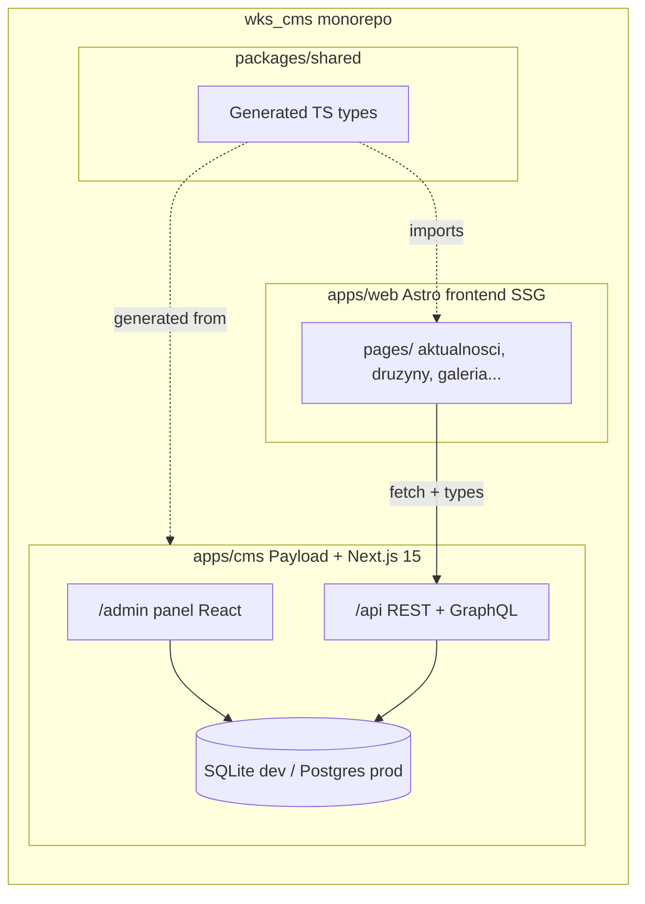
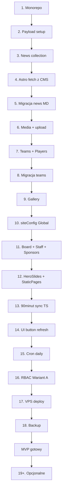

# Roadmap implementacji Payload CMS dla WKS Wierzbice

> Operacyjny dokument wykonawczy — lista etapów implementacji panelu admina
> w Payload CMS 3 + monorepo (`apps/web` + `apps/cms` + `packages/shared`).
>
> **Powstał:** 2026-04-25 po decyzjach D1 (Payload) i D2 (monorepo).
> **Konwencja:** każdy etap = 2–6 h pracy = jedna konkretna rzecz działa
> lokalnie, z test-case'em na końcu.
>
> **Powiązane:** [`ADMIN-PANEL.md`](ADMIN-PANEL.md) (encje, RBAC, integracja
> 90minut), [`STACK-COMPARISON.md`](STACK-COMPARISON.md) (uzasadnienie wyboru
> Payload), [`OFERTA.md`](OFERTA.md) (scope, ekonomia).

---

## Cel i konwencja

**Cel:** dostarczyć działający panel admina pozwalający zarządzać wszystkimi
encjami strony (12 grup z [`ADMIN-PANEL.md`](ADMIN-PANEL.md)), z 3 rolami
RBAC i integracją z 90minut.pl, deployowany na VPS z backupem.

**Konwencja drobnych etapów (decyzja Tomka 2026-04-25):**
- 1 etap = 2–6 h pracy.
- Każdy etap kończy się **konkretnym test-case'em** — coś musi działać
  lokalnie i być sprawdzalne ręcznie.
- Po każdym etapie aktualizujemy [`STATE.md`](STATE.md) (status etapu) i
  dopisujemy do [`CHANGELOG.md`](CHANGELOG.md).
- Przed startem każdego etapu Claude zadaje 1–2 pytania doprecyzowujące
  jeżeli pojawiły się otwarte decyzje (zgodnie z zasadą Tomka „przed każdą
  czynnością zapytaj").

**Łączna estymata:** 60–80 h (tak jak w [`STACK-COMPARISON.md`](STACK-COMPARISON.md)).

---

## Architektura docelowa

**Kluczowe założenia architektury:**
- `apps/web` zachowuje SSG (zero JS po stronie klienta poza wyjątkami z
  `CLAUDE.md`) — przy buildzie pobiera dane z Payload REST API.
- `apps/cms` to standalone Next.js 15 z Payload — własny `package.json`,
  własny deploy.
- `packages/shared` zawiera typy generowane przez `payload generate:types`
  importowane przez `apps/web` dla type-safety przy fetch.

---

## Decyzje techniczne

### RESOLVED w trakcie planowania

| ID | Decyzja | Wynik | Data |
|---|---|---|---|
| D1 | Stack panelu admina | Payload CMS 3 | 2026-04-25 |
| D2 | Struktura repo | Monorepo (`apps/web` + `apps/cms` + `packages/shared`) | 2026-04-25 |
| D9 | Scope encji | Pełen (wszystkie encje z OFERTA.md Q5) | 2026-04-25 |

### Do podjęcia w konkretnych etapach

| ID | Decyzja | Etap, w którym zapadnie | Wstępny default |
|---|---|---|---|
| D4 | Baza danych | Etap 2 (dev) + Etap 17 (prod) | SQLite dev → Postgres 16 prod |
| D5 | Auth | Etap 2 | Payload built-in: email + password |
| D7 | Model RBAC | Etap 16 | Wariant A (3 sztywne role: admin/redaktor/trener) |
| D8 | Model galerii | Etap 9 | Wariant 1 (płaska lista, gotowość na albumy) |
| D3 | Hosting | Etap 17 | VPS (Hetzner CX22 albo OVH SSD) |
| D6 | Backup | Etap 18 | `pg_dump` cron → Backblaze B2, retention 30 dni |
| D10 | Migracja MD→DB | Per encja (Etapy 5, 8, 10, 11) | Skrypty seed używające Payload Local API |

---

## Etapy

### Faza A — fundament (Etapy 1–3, ~10–16 h)

#### Etap 1. Restrukturyzacja monorepo

**Status:** [x] DONE 2026-04-25 — commit `aa7a9fd` (poprzedzony baseline `ce94e46`).
Decyzje: npm workspaces, nazewnictwo `apps/web` + `apps/cms` + `packages/shared`,
Node 20.18.0 LTS (.nvmrc + engines >=20). Bezpieczeństwo: `git init` + commit
baseline przed restrukturyzacją (rollback przez `git reset --hard ce94e46`).
Test pełen przeszedł: dev (504 ms), 4 szablony renderują, sync (16 drużyn /
240 meczów), build (40 stron / 1.35 s / 7.1 MB w `apps/web/dist/`).

**Co robimy:**
- Tworzymy strukturę `apps/web/` i przenosimy do niej obecne: `src/`, `public/`, `scripts/`, `astro.config.mjs`, `tailwind.config.mjs`, `tsconfig.json`, `package.json` (renamed do `apps/web/package.json`).
- Tworzymy korzeń monorepo z nowym `package.json` z `workspaces: ["apps/*", "packages/*"]`.
- Pusty `apps/cms/` (placeholder, wypełnimy w Etapie 2).
- Pusty `packages/shared/` z minimalnym `package.json`.
- Aktualizacja [`CLAUDE.md`](../CLAUDE.md) ścieżek (`src/` → `apps/web/src/`).

**Test:**
- `npm install` w korzeniu monorepo działa.
- `npm run dev --workspace=web` → strona działa jak była na localhost:4321.
- `npm run build --workspace=web` → `apps/web/dist/` powstaje, ten sam build co wcześniej.
- Test wizualny: wszystkie 4 szablony (klasyk/marka/magazyn/stadion) renderują się poprawnie.

**Decyzje przed startem:**
- Workspace manager: npm / pnpm / yarn?
- Wersja Node.js do ustabilizowania (Payload 3 wymaga Node 20+).

#### Etap 2. Setup Payload CMS w `apps/cms/`

**Status:** [x] **DONE (2026-04-25)**

**Co zrobiliśmy:**
- `nvm install 20.18.0 && nvm use 20.18.0` (default alias) — Payload 3 oficjalnie wspiera Node 20.9+; nasza poprzednia wersja v25 była eksperymentalna.
- `npx create-payload-app@latest -n cms -t blank --use-npm --no-agent` w `apps/` (interaktywnie wybrane: SQLite, default connection string `file:./cms.db`).
- Wynik: `apps/cms/` z Payload 3.84.1, Next.js 16.2.3, React 19.2.4, `@payloadcms/db-sqlite` 3.84.1, dodatkowo Playwright + Vitest (defaultowe testy z templatu).
- Struktura: `src/payload.config.ts` (główny config), `src/collections/Users.ts` + `Media.ts` (built-in collections), `src/app/(payload)/admin/[[...segments]]/page.tsx` (routing panelu), `src/app/(payload)/api/[...slug]/route.ts` (REST), `src/app/(payload)/api/graphql/route.ts`.
- `apps/cms/.env`: `DATABASE_URL=file:./cms.db`, `PAYLOAD_SECRET=<32 random bytes hex z openssl rand>` — plik w `.gitignore`.
- `apps/cms/.env.example` zaktualizowany — z domyślnego MongoDB connection na nasze `file:./cms.db`.
- Root `.npmrc` — `legacy-peer-deps=true` (Payload 3 + Next 16 + React 19 mają nieszkodliwe peer-dep konflikty na npm).
- Root `package.json` rozszerzony o skrypty: `dev:cms`, `build:cms`, `payload`, `generate:types`, `generate:importmap` (proxy `--workspace=cms`).
- `apps/cms/next.config.ts`: ustawione `outputFileTracingRoot` + `turbopack.root` na root monorepo (`apps/cms/../..`) — bez tego Next 16 / Turbopack rzuca błąd "couldn't find next/package.json" w monorepo.
- Root `.gitignore` rozszerzony o `apps/cms/*.db`, `apps/cms/*.db-journal`, `apps/cms/uploads/`, `apps/cms/.next/`.

**Decyzje rozstrzygnięte:**
- DB nazwa pliku: `cms.db` (default z create-payload-app — zostawiamy zamiast forsować `payload.db`, mniej tarcia).
- Auth: email + password, brak OAuth (default Payload, zgodnie z D5).
- Port: 3000 (default Next, zgodnie z roadmap).

**Test (wszystkie przeszły):**
- ✅ `npm run dev:cms` → Next.js Turbopack ready in 268ms na `http://localhost:3000` (0 errors, 0 warnings po fixie root paths).
- ✅ `curl http://localhost:3000/admin` → HTTP 200, HTML 55 KB z formularzem `create-first-user` (email + password + register).
- ✅ `curl -X POST /api/users/first-register {email,password,passwordConfirm}` → HTTP 200, `"Successfully registered first user"`, JWT token, `id: 1`.
- ✅ `curl -X POST /api/users/login {email,password}` → HTTP 200, `"Authentication Passed"`, JWT token, sesja zapisana w `cms.db`.
- ✅ `apps/cms/cms.db` (160 KB) wygenerowany z poprawnym schema + 1 user + 2 sesje.
- ✅ `npm run build` (web) → 40 stron Astro built in 1.58s — frontend z Etapu 1 nietknięty.
- ✅ `git status --ignored` potwierdza: `apps/cms/.env` i `apps/cms/cms.db` są ignored (sekret nie idzie do gita).

**Konto admin (dev):**
- email: `admin@wks-wierzbice.pl`
- hasło: `WKSadmin2026!` (TYLKO DEV — w Etapie 17 zmieniamy na właściwe production credentials)
- panel: http://localhost:3000/admin (kiedy `npm run dev:cms` jest uruchomiony)

#### Etap 3. Pierwsza encja `News` w Payload

**Status:** [x] **DONE (2026-04-25)**

**Co zrobiliśmy:**
- `apps/cms/src/collections/News.ts` — schema 1:1 z Zod (`apps/web/src/content/config.ts`) + 2 nowe pola wymagane dla CMS:
  - `slug` (text, unique, indexed) — auto-generowany z `title` przez hook `beforeValidate` z możliwością ręcznego override (decyzja Etap 3).
  - `body` (richText Lexical) — w Astro było to "wszystko po `---`", w Payload musi być explicit field.
- `apps/cms/src/collections/Tags.ts` — **nowość poza pierwotnym planem**: zamiast `select hasMany` z hardcoded opcjami zrobiliśmy osobną kolekcję `Tags` z relacją `hasMany` (decyzja Tomka — redaktor może sam dodać nowy tag bez czekania na admina/push do gita).
- `apps/cms/src/utils/slugify.ts` — zero-dep slugify obsługujący polskie znaki (`ł→l`, NFD dla diakrytyków `ą→a`, `ę→e`, `ó→o`, `ż→z`...) + emoji + limit 100 znaków.
- Rejestracja w `payload.config.ts`: `collections: [Users, Media, News, Tags]`.
- Polskie etykiety w panelu (`labels.singular.pl`, `labels.plural.pl`, `label.pl` na każdym polu) — przygotowanie pod Etap 21 (i18n).
- Pola pogrupowane przez `admin.position: 'sidebar'` (sidebar: data, draft, slug, tags, author / main: title, excerpt, body, cover, coverAlt, facebookUrl, truncated).
- `defaultSort: '-date'` — najnowsze na górze listy w panelu.
- Walidacja `facebookUrl` — custom `validate` z polskimi komunikatami błędów ("Niepoprawny URL.", "URL musi zaczynać się od http:// lub https://").
- `npm run generate:types` — wygenerowano `apps/cms/src/payload-types.ts` (454 linie z `User`, `Media`, `News`, `Tag` interfaces + `*Select` typy do query selecting).

**Decyzje rozstrzygnięte (zadane userowi przed startem):**
- **Tags strategy:** osobna kolekcja `Tags` z relacją (Wariant C z 3 zaproponowanych) — zamiast initially planowanego `select hasMany` z 14 hardcoded opcjami.
- **Slug strategy:** auto z możliwością ręcznego override (Wariant A — najpopularniejszy w 95% projektów Payload).
- **Body editor:** Lexical RichText (default Payload) — WYSIWYG dla redakcji bez znajomości markdown. Migracja .md → Lexical przez serializer w Etapie 5.
- **Scope:** sam schema + smoke test przez API (bez ręcznego klikania w przeglądarce).

**Test (16/16 ✅) — full CRUD + walidacje przez REST API:**
1. ✅ `GET /api/news` → HTTP 200, `totalDocs: 0` (puste, kolekcja zarejestrowana).
2. ✅ `GET /api/tags` → HTTP 200, `totalDocs: 0` (kolekcja zarejestrowana).
3. ✅ `POST /api/tags {name: "seniorzy"}` → HTTP 200, slug auto = `seniorzy`.
4. ✅ `POST /api/tags {name: "zwycięstwo"}` → HTTP 200, slug auto = `zwyciestwo` (polskie znaki obsłużone).
5. ✅ `POST /api/news` z 11 polami + 2 tagami w relacji + Lexical body → HTTP 200, news id=1, slug auto = `zwycieska-seria-trwa` (z tytułu z polskim znakiem + emoji 🫡).
6. ✅ `PATCH /api/news/1 {slug: "seniorzy-marszowice-2-0", draft: true}` → slug poprawnie nadpisany, draft toggle.
7. ✅ `POST /api/news` z `facebookUrl: "not-a-url"` → HTTP 400, `{"label":"Facebook post URL","message":"Niepoprawny URL.","path":"facebookUrl"}` — walidacja działa po polsku.
8. ✅ `GET /api/news/1?depth=2` → tags populated z pełnymi obiektami (`[{id, name, slug, ...}]`).
9. ✅ `GET /api/news?where[draft][equals]=true` → `totalDocs: 1` (filter działa).
10. ✅ `GET /api/news?where[draft][equals]=false` → `totalDocs: 0` (filter działa po stronie SQLite).
11. ✅ `DELETE /api/news/1` → HTTP 200, `"Deleted successfully."`.
12. ✅ `GET /api/news` (po delete) → `totalDocs: 0`.
13. ✅ `GET /api/tags` (po delete news) → `totalDocs: 2` (tagi przeżyły usunięcie newsa, relacja hasMany nie kaskaduje delete).
14. ✅ `sqlite3 cms.db .tables` → tabele `news`, `news_rels` (junction), `tags`, `media`, `users`, `users_sessions`, plus systemowe Payload (`payload_kv`, `payload_locked_documents`, `payload_locked_documents_rels`, `payload_migrations`, `payload_preferences`, `payload_preferences_rels`).
15. ✅ `npm run generate:types` → wygenerowano `payload-types.ts` z `News`, `Tag`, `User`, `Media` interfaces.
16. ✅ Linter: 0 błędów w News.ts, Tags.ts, slugify.ts, payload.config.ts.

**Pułapki które trzeba było obejść:**
- **Push mode + zmiana schema =** `SQLITE_ERROR: index ... already exists`. Payload przy każdym restarcie próbuje re-applikować DDL i kolizja z indexami systemowymi. **Fix:** clean slate dev DB (`rm -f cms.db cms.db-journal cms.db-shm cms.db-wal`) + ponowny first-user signup. **W Etapie 17** przejdziemy na proper migrations (drizzle-kit migrate).
- **Stale dev server po killu** — Next 16 zostawia detached process który blokuje port 3000. **Fix:** zawsze `pgrep -lf "next dev"` przed restartem.

**Konto admin (DEV ONLY) odtworzone:** `admin@wks-wierzbice.pl` / `WKSadmin2026!`.

---

### Faza B — frontend czyta z CMS (Etapy 4–5, ~6–10 h)

#### Etap 4. Astro odpytuje Payload REST

**Status:** [x] DONE (2026-04-26)

**Decyzje (potwierdzone przez Tomka przed startem):**
- **CMS down → graceful fallback do `.md`** (zamiast fail hard). Build nigdy się nie wywali, na konsoli ostrzeżenie `[cms] Niedostępne (...): ... — fallback do .md`. Po Etapie 5 (gdy 24 .md wpadną do CMS) fallback nadal pełni rolę safety net.
- **Pliki `.md` zostawiamy do Etapu 5** (wtedy migracja → CMS, dopiero wtedy delete). Są też live backup-em na czas tego etapu.
- **Lexical → HTML async serializer** (`@payloadcms/richtext-lexical/html-async` → `convertLexicalToHTMLAsync`), wstrzykiwany w Astro przez `<Fragment set:html={...}>` z `disableContainer: true`.
- **Zakres: tylko `/aktualnosci/*`** (lista + single). Homepage `pages/index.astro` przepiszemy w osobnym Etapie 4b — mniejsza powierzchnia commita = łatwiejszy rollback.
- **Shared types przez `@wks/shared`** (workspace package), re-export `News, Tag, Media, User` z `apps/cms/src/payload-types.ts`. Front nie kopiuje typów, tylko re-eksportuje.

**Co zostało zrobione:**
- `packages/shared/index.ts` — re-export `News, Tag, Media, User` z `apps/cms/src/payload-types.ts`. `apps/web/package.json` dostał `"@wks/shared": "*"`. Wpięte przez `tsconfig.paths` (`@wks/shared` → `../../packages/shared/index.ts`) i hoisted przez npm workspaces do root `node_modules/@wks/shared` jako symlink.
- `apps/web/src/lib/cms.ts` — fetcher REST API:
  - `fetchNewsList()` — `GET /api/news?depth=2&limit=500&sort=-date&where[draft][equals]=false` z `AbortSignal.timeout(5000ms)`.
  - Adapter `adaptCmsNews()` mapuje `News` z Payload → unified `NewsItem` (Date z ISO string, tags z `Tag[]` → `string[]` po nazwach).
  - Adapter `adaptMdEntry()` mapuje `CollectionEntry<'news'>` → ten sam `NewsItem`.
  - Try/catch + sprawdzanie `res.ok` → fallback do `getCollection('news')`. Warning na konsolę, build się NIE wywala.
  - Body w `NewsItem` to dyskryminator: `{type:'lexical', value}` lub `{type:'md', entry}` lub `{type:'empty'}`.
- `apps/web/src/lib/lexical.ts` — wrapper `lexicalToHtml(body)` używający `convertLexicalToHTMLAsync({ data, disableContainer: true })`. Zwraca `''` jeśli body puste.
- `apps/web/.env` (gitignored) + `apps/web/.env.example` — `CMS_URL=http://localhost:3000` (default).
- `apps/web/src/pages/aktualnosci/index.astro` — `getCollection('news')` → `fetchNewsList()`. Identyczna prezentacja, zero zmian w `NewsCard.astro` (był już agnostyczny wobec źródła danych).
- `apps/web/src/pages/aktualnosci/[slug].astro` — `getStaticPaths` używa `fetchNewsList()`, body renderowane przez `<MdContent />` (gdy źródło=md, używa Astro `entry.render()`) lub `<Fragment set:html={bodyHtml} />` (gdy źródło=cms, przez Lexical).
- `apps/cms/scripts/seed-test-news.ts` — idempotentny seed używający Payload Local API (`getPayload({ config })`), tworzy 1 tag i 1 news z Lexical body (heading H2 + paragraph z bold + bullet list z italic). Repeatable narzędzie do dev. Uruchomienie: `npx tsx apps/cms/scripts/seed-test-news.ts`.

**Test (manual, oba scenariusze):**
- ✅ **CMS UP:** `curl http://localhost:3000/api/news?...` zwraca 1 news (`testowy-news-z-cms`). `curl http://localhost:4321/aktualnosci/` pokazuje TYLKO ten news (pliki .md zignorowane bo CMS odpowiedział). `curl http://localhost:4321/aktualnosci/testowy-news-z-cms/` renderuje:
  - `<h2>Pierwszy news z CMS</h2>` ✓
  - `
...<strong>/aktualnosci</strong>, integracja działa.
` ✓
  - `<ul class="list-bullet"><li>Lista działa</li><li><em>Italic też</em></li></ul>` ✓
  - Header: autor "Seed script" + tag "seniorzy" (z relacji depth=2) ✓
- ✅ **CMS DOWN:** zatrzymałem CMS (`kill <pid>`), `npx astro build` w `apps/web/`:
  - Exit 0, `[build] 40 page(s) built in 1.62s`.
  - Dwa warningi `[cms] Niedostępne (http://localhost:3000): fetch failed — fallback do .md` (1× dla `/aktualnosci/[slug]` getStaticPaths, 1× dla listy).
  - 24 stron `aktualnosci/<slug>/index.html` (wszystkie z `.md`) + `aktualnosci/index.html`.
  - Brak `testowy-news-z-cms` w `dist/` (bo CMS down, fallback go nie zna).

**Pułapki które trzeba było obejść:**
- **`PAYLOAD_SECRET` undefined w seed scripcie** — `payload.config.ts` czyta `process.env.PAYLOAD_SECRET` na top-levelu. Hoisting ESM importów powodował, że `dotenv` ładował się PO importu konfigu. **Fix:** dynamiczny import: `dotenvConfig({ path })` najpierw, potem `await import('payload')` i `await import('../src/payload.config')`.
- **Tag "Seniorzy" → ValidationError unique slug** — case mismatch z istniejącym tagiem `seniorzy` (lowercase) z testów Etap 3. Slugify obu daje to samo `'seniorzy'` → kolizja na `unique: true`. **Fix:** `TAG_NAME = 'seniorzy'` (lowercase) w seed → idempotentny `find({ name: { equals: 'seniorzy' } })` znajduje istniejący tag.

**Zostawione na Etap 4b (osobny mini-stage przed Etap 5):**
- `apps/web/src/pages/index.astro` (homepage) wciąż używa `getCollection('news')`. Trzeba przepisać na `fetchNewsList()`.

#### Etap 5. Migracja 24 newsów MD → Payload

**Status:** [ ] not started

**Co robimy:**
- `apps/cms/scripts/migrate-news.ts` — czyta wszystkie `apps/web/src/content/news/*.md` przez `gray-matter`, parsuje frontmatter, używa Payload Local API (`getPayload({ config }).create({ collection: 'news', data })`).
- Mapowanie pól: `date` (string → Date), `tags`, `cover` (string ścieżki → na razie zostaje string, w Etapie 6 podmienimy na upload).
- Idempotentność: skrypt sprawdza czy news o danym `slug` już istnieje, pomija duplikaty.

**Test:**
- `npm run migrate:news --workspace=cms` → 24 newsy w bazie.
- /aktualnosci pokazuje wszystkie 24, posortowane po dacie malejąco.
- Wyrywkowo sprawdzam 3 newsy: tytuł, data, tagi, cover, treść poprawne.
- Re-run skryptu nie tworzy duplikatów.

---

### Faza C — media + drużyny (Etapy 6–8, ~10–16 h)

#### Etap 6. Collection `Media` + upload obrazków

**Status:** [ ] not started

**Co robimy:**
- `apps/cms/src/collections/Media.ts` — built-in Payload upload collection.
- Konfiguracja sharp: resize do max 1600 px, konwersja do WebP, thumbnaile (320, 640, 1024).
- Storage: `apps/cms/uploads/` (lokalnie), w produkcji to samo na VPS (Etap 17).
- Pole `cover` w `News` zmienione z `text` na `upload` z `relationTo: 'media'`.
- Skrypt `migrate-news-covers.ts` — pobiera istniejące pliki z `apps/web/public/news/*` i tworzy rekordy Media + linkuje do odpowiednich newsów.

**Test:**
- W panelu: dodaję nowy news, klikam „upload cover", wybieram plik z dysku → zdjęcie się ładuje, preview widać w panelu.
- /aktualnosci wyświetla cover (już z Payload, nie z `public/news/`).
- Sprawdzam wymiary uploadowanego zdjęcia w `apps/cms/uploads/` — są resized do 1600 px max + WebP.
- Wszystkie 24 zmigrowane newsy mają poprawne covery.

#### Etap 7. Collections `Teams` + `Players`

**Status:** [ ] not started

**Co robimy:**
- `apps/cms/src/collections/Teams.ts` — pola z `teams` schema w `apps/web/src/content/config.ts`: `name`, `category` (select enum), `league`, `coach`, `assistantCoach`, `trainingSchedule`, `photo` (upload), `order`, `description` (richText).
- `apps/cms/src/collections/Players.ts` — `name`, `number`, `position`, `team` (relationship `relationTo: 'teams'`), `photo` (opcjonalne, upload).
- Decyzja modelowa: roster jako osobna kolekcja `Players` z relacją do `Teams` (zamiast embedded array) — pozwala na granular edit i przyszłość (statystyki per zawodnik).
- Modyfikacja `apps/web/src/pages/druzyny/[slug].astro` — fetch `teams/{slug}` + `players?where[team][equals]={teamId}`.

**Test:**
- W panelu dodaję nową drużynę, ustawiam dane.
- Dodaję 3 zawodników, przypisuję do drużyny.
- /druzyny/{slug} renderuje drużynę z bazy + 3 zawodników.
- Grupowanie po pozycji (Bramkarze/Obrońcy/Pomocnicy/Napastnicy) działa.

#### Etap 8. Migracja 5 drużyn MD → Payload

**Status:** [ ] not started

**Co robimy:**
- `apps/cms/scripts/migrate-teams.ts` — analogicznie do Etapu 5, parsuje `apps/web/src/content/teams/*.md`.
- Dla każdej drużyny: tworzy rekord `teams`, potem iteruje po `roster[]` z YAML-a, tworzy rekordy `players` z relacją.
- Migracja zdjęć drużyn z `apps/web/public/team/` → kolekcja `Media`.

**Test:**
- `npm run migrate:teams --workspace=cms` → 5 drużyn + ich zawodnicy w bazie.
- /druzyny pokazuje 5 drużyn w kolejności `order`.
- Każda drużyna ma poprawny skład (np. seniorzy = 22 zawodników).
- Trenerzy + assistantCoach poprawni.

---

### Faza D — reszta treści (Etapy 9–12, ~12–20 h)

#### Etap 9. Collection `Gallery`

**Status:** [ ] not started

**Co robimy:**
- `apps/cms/src/collections/Gallery.ts` — pola: `image` (upload), `alt`, `caption`, `order`, `category` (opcjonalne, na przyszłość).
- Decyzja: Wariant 1 (płaska lista). `albumId` zostawiamy jako pole opcjonalne, w przyszłości można dodać kolekcję `Albums` bez breaking change.
- Modyfikacja `apps/web/src/pages/galeria.astro` — fetch z Payload zamiast `GALLERY[]` z `site.ts`.

**Test:**
- Upload 3 zdjęć w panelu.
- /galeria pokazuje 3 zdjęcia.
- Lightbox modal działa (klawiatura, prev/next).
- Migracja istniejących placeholder SVG nie jest konieczna (to placeholdery, klub doda prawdziwe).

#### Etap 10. Globals `siteConfig`

**Status:** [ ] not started

**Co robimy:**
- `apps/cms/src/globals/SiteConfig.ts` — Payload Global (singleton) z polami CONTACT (telefon, email, adres stadionu, biuro, Google Maps), SOCIAL (FB/IG/YT/TikTok URL + obserwujący), STATS (linki na 90minut/transfermarkt/dolfutbol), NAV (array), HIGHLIGHTS (3 obiekty: pozycja w lidze, król strzelców, awans).
- Skrypt `migrate-site-config.ts` — czyta `apps/web/src/config/site.ts` (dynamic import) i wstawia jako jeden rekord Global.
- Modyfikacja `apps/web/src/components/Footer.astro`, `apps/web/src/pages/kontakt.astro` itp. — fetch `globals/siteConfig` zamiast import z `site.ts`.

**Test:**
- W panelu w sekcji „Globals" widać `Site Config` jako pojedynczy rekord.
- Edycja telefonu w panelu → zmiana na localhost:4321/kontakt.
- Edycja URL FB → zmiana w stopce wszystkich stron.

#### Etap 11. Collections `Board`, `Staff`, `Sponsors`

**Status:** [ ] not started

**Co robimy:**
- 3 osobne collections w `apps/cms/src/collections/`.
- `Board`: name, role, bio, photo (upload), order.
- `Staff`: name, role, bio, photo, order, type (enum: trener_pierwszej_druzyny | trener_mlodziezy | inne).
- `Sponsors`: name, tier (enum: strategiczny | glowny | wspierajacy), logo (upload), website.
- Skrypty migracji per kolekcja, podobnie do Etapu 5.

**Test:**
- /o-klubie pokazuje zarząd z bazy (6 osób, zdjęcia z Media).
- /o-klubie pokazuje sztab z bazy (Pożarycki + Rycombel + zdjęcia).
- /sponsorzy pokazuje sponsorów (na razie z migracji, klub potem zaktualizuje w panelu).

#### Etap 12. Collection `HeroSlides` + `StaticPages`

**Status:** [ ] not started

**Co robimy:**
- `HeroSlides`: image, kicker, title, subtitle, ctaLabel, ctaHref, order, active.
- `StaticPages`: slug (unique enum: o-klubie | nabory | kontakt | polityka-prywatnosci), title, body (richText).
- Modyfikacja `apps/web/src/components/Hero.astro` — fetch active slides z Payload sortowane po `order`.
- Modyfikacja `apps/web/src/pages/o-klubie.astro` itd. — fetch `staticPages/{slug}` i renderuj `body`.

**Test:**
- Edycja slajdu w panelu (zmiana tytułu) → widoczne na home.
- Edycja treści `/o-klubie` w panelu (richText editor) → widoczne na froncie.
- Wyłączenie slajdu (`active = false`) → znika z karuzeli.

---

### Faza E — integracja 90minut + RBAC (Etapy 13–16, ~14–20 h)

#### Etap 13. Refactor `sync-90minut.mjs` na funkcję TS w CMS

**Status:** [ ] not started

**Co robimy:**
- Przenoszę logikę `apps/web/scripts/sync-90minut.mjs` do `apps/cms/src/lib/sync-season.ts` jako funkcję TypeScript.
- Tworzę kolekcję `Season` (singleton Global) z polami: `lastSync` (timestamp), `lastSyncStatus` (enum: idle | running | success | error), `lastSyncError` (text), `data` (JSON).
- Custom endpoint `apps/cms/src/endpoints/sync-season.ts` zarejestrowany w `payload.config.ts` jako `POST /api/season/sync`.
- Endpoint waliduje uprawnienia (tylko admin), startuje async job, zwraca natychmiast `202 Accepted`.

**Test:**
- `curl -X POST -H "Authorization: JWT <token>" http://localhost:3000/api/season/sync` → `202 Accepted`.
- Po ~30 s w bazie `Season.lastSync` jest aktualny, `lastSyncStatus = success`, `data` wypełnione.
- /terminarz na froncie pokazuje świeże dane.
- Bez tokenu: `401 Unauthorized`.

#### Etap 14. Custom UI button w panelu „Odśwież teraz"

**Status:** [ ] not started

**Co robimy:**
- Custom React component w `apps/cms/src/components/SyncButton.tsx` zarejestrowany jako `views.Dashboard.Component` w `payload.config.ts`.
- Komponent pokazuje: aktualny status (idle/running/success/error), timestamp ostatniej synchronizacji, button „Odśwież teraz".
- Klik → `fetch POST /api/season/sync` → polling co 2 s aż status zmieni się na success/error.

**Test:**
- Wchodzę na `/admin` jako admin → na dashboardzie widzę kafelek „Wyniki 90minut" z ostatnim sync timestamp.
- Klikam „Odśwież teraz" → status zmienia się na „Trwa synchronizacja…" → po ~30 s na „Sukces" + nowy timestamp.
- W przypadku błędu (np. odcinam internet) → status „Błąd" + treść błędu.

#### Etap 15. Cron raz dziennie

**Status:** [ ] not started

**Co robimy:**
- Payload Jobs Queue v3 (built-in) lub `node-cron` jeśli prościej.
- Definicja jobu `daily-season-sync` schedule `0 6 * * *` (06:00 codziennie).
- Job uruchamia tę samą funkcję `sync-season.ts` co Etap 13.

**Test:**
- Tymczasowo ustawiam schedule na `*/1 * * * *` (co 1 minutę).
- Czekam 2 minuty → w bazie `Season.lastSync` aktualizuje się 2 razy.
- Przywracam `0 6 * * *` (lub konfiguruję przez env var).

#### Etap 16. RBAC Wariant A (3 sztywne role)

**Status:** [ ] not started

**Co robimy:**
- Pole `role` w kolekcji `Users` (select: admin | redaktor | trener).
- Pole `team` w `Users` (relationship → `teams`, opcjonalne, używane tylko dla trenerów).
- Funkcje `access` per kolekcja w TS — zgodnie z CRUD matrix w [`ADMIN-PANEL.md`](ADMIN-PANEL.md).
- Trener: `access.update.players` sprawdza `req.user.team === doc.team`.

**Test:**
- Tworzę 3 użytkowników: admin@test, redaktor@test (rola redaktor), trener.seniorzy@test (rola trener, team=seniorzy).
- Loguję jako redaktor → mogę edytować newsy (OK), ale sekcja Users w sidebarze niedostępna.
- Loguję jako trener.seniorzy → mogę edytować skład seniorzy (OK).
- Próba edycji składu juniorzy jako trener.seniorzy → 403 Forbidden.
- Próba edycji sponsorów jako redaktor → niedostępna w UI (patrz CRUD matrix).

---

### Faza F — production-ready (Etapy 17–18, ~12–20 h)

#### Etap 17. VPS setup + Postgres + deploy

**Status:** [ ] not started

**Co robimy:**
- Wybór VPS (Hetzner CX22 / OVH SSD / Mikr.us).
- Provisioning: Ubuntu 24.04, Node 20, Postgres 16, Caddy.
- Migracja SQLite → Postgres: zmiana adapter w `payload.config.ts` na `@payloadcms/db-postgres`, `payload migrate` generuje migrations, `payload migrate` na produkcji wstawia.
- Eksport danych z lokalnej SQLite + import do prod Postgres (skrypt seed).
- Caddy reverse proxy:
  - `cms.wkswierzbice.pl` → `:3000` (Payload)
  - `wkswierzbice.pl` → static files z `apps/web/dist/` (build na CI lub lokalnie)
- HTTPS Let's Encrypt automatycznie via Caddy.
- Deployment proces: `npm run build --workspace=web` → `scp dist/* server:/srv/wks/web/`; `git pull && npm install && npm run build --workspace=cms && pm2 restart cms` na serwerze.

**Test:**
- `https://wkswierzbice.pl/aktualnosci` → wyświetla newsy z prod Postgres.
- `https://cms.wkswierzbice.pl/admin` → logowanie działa.
- Edycja newsa w prod panelu → po `npm run build --workspace=web` + redeploy strony zmiana widoczna.

**Decyzje przed startem:**
- D3: który VPS provider? Wstępnie Hetzner CX22 (~5 EUR/mies., niemiecka lokalizacja, dobry latency dla PL).

#### Etap 18. Backup automatyczny

**Status:** [ ] not started

**Co robimy:**
- Cron na VPS: `0 3 * * * pg_dump wkswierzbice | gzip | rclone rcat b2:wks-backups/$(date +%Y-%m-%d).sql.gz`.
- Konfiguracja Backblaze B2 (~5 zł/mies. za 10 GB).
- Retention: skrypt usuwający backupy starsze niż 30 dni (`rclone delete --min-age 30d`).
- Dokument [`docs/RUNBOOK.md`](RUNBOOK.md) z instrukcją restore.

**Test:**
- `pg_dump wkswierzbice > /tmp/test.sql` → plik powstaje.
- Plik trafia na Backblaze (sprawdzam w panelu B2).
- Symuluję restore: tworzę nową bazę test, `psql test < /tmp/test.sql`, sprawdzam że dane są.
- Po dniu w B2 widzę 1 backup, po tygodniu 7, retention działa.

---

## Etapy opcjonalne (po MVP)

Do zrobienia po przekazaniu klubowi i zebraniu feedbacku:

- **Etap 19. RBAC Wariant B** — per-zasób override (admin może dodać redaktorowi prawo do edycji sponsorów).
- **Etap 20. Galeria Wariant 2** — kolekcja `Albums` + relacja `Gallery.album`. Strona `/galeria` jako lista albumów.
- **Etap 21. Polskie tłumaczenie panelu Payload** — przegląd kluczy i18n, override dla najważniejszych etykiet.
- **Etap 22. Branding panelu** — kolory klubu (zielony/biały/czerwony), herb jako favicon panelu, logo w sidebarze.
- **Etap 23. Audit log** — kolekcja `AuditLog` z wpisami „kto/kiedy/co zmienił", widoczna tylko dla admina.
- **Etap 24. Szkolenie redakcji + dokumentacja** — `INSTRUKCJA-DLA-REDAKCJI.md` po polsku, screencast 5–10 min.

---

## Kolejność i zależności

**Krytyczne ścieżki:**
- Etapy 1–6 są sekwencyjne (każdy zależy od poprzedniego).
- Od Etapu 7 można iść równolegle (np. teams i gallery niezależne), ale dla
  „małych kroków" lepiej trzymać się sekwencji.
- Etap 17 (deploy) może być wcześniej (np. po Etapie 5) jeśli Tomek chce
  prod env do testów z prawdziwymi obrazami CMS-a — wtedy każdy kolejny
  etap dochodzi z deployem.

---

## Status

Po każdym etapie aktualizujemy:
- Checkbox `[ ]` → `[x]` w sekcji etapu wyżej.
- Dopisek pod etapem: data ukończenia + commit SHA + krótka notka co poszło OK / co wymagało zmian.
- Wpis do [`STATE.md`](STATE.md) w sekcji „Wariant 2 / Panel admina".
- Wpis do [`CHANGELOG.md`](CHANGELOG.md) z datą sesji.

**Stan na 2026-04-25 (po sesji 3 — szósta tura):**
- ✅ Etap 1 DONE (monorepo + git init).
- ✅ Etap 2 DONE (Payload zainstalowany, /admin działa, first-user signup OK).
- ✅ Etap 3 DONE (kolekcje News + Tags z relacją hasMany, slugify PL, Lexical body, walidacje PL, full CRUD przez API).
- ⏳ Etapy 4–18 nie rozpoczęte.
- **Następny:** Etap 4 — Astro odpytuje Payload REST (zamiast `getCollection('news')` z plików .md → fetch z `/api/news?where[draft][equals]=false&sort=-date`).
